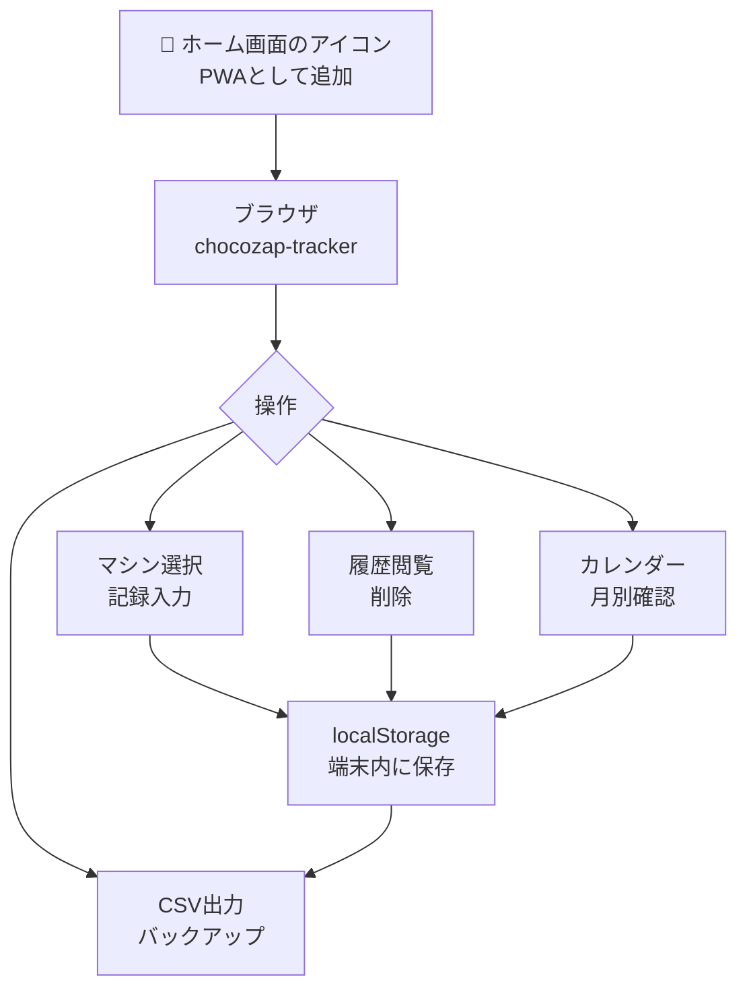
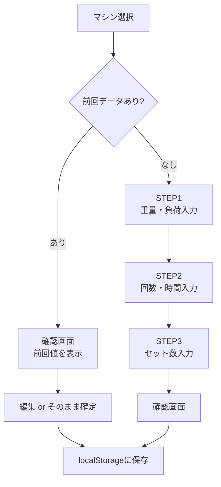

# chocozap-tracker 仕様書

## 概要
チョコザップ広島八木店でのトレーニング記録をスマートフォンで管理するPWA。オフライン動作対応、ホーム画面に追加して使用。データはブラウザのlocalStorageに保存。

## アーキテクチャ



## 動作環境
| 項目 | 内容 |
|------|------|
| ホスティング | GitHub Pages（otaka2024/chocozap-tracker） |
| データ保存 | ブラウザ localStorage（端末内） |
| オフライン | Service Worker対応 |
| 対応環境 | iOS Safari 11.3以上 / Android Chrome |

## ファイル構成
```
chocozap-tracker/
├── index.html       # 全コード（UI + ロジック）
├── manifest.json    # PWA設定（アイコン・テーマ色）
└── sw.js            # Service Worker（オフライン対応）
```

## 対応マシン（10種類）
| マシン | 入力 |
|--------|------|
| レッグプレス | 重量(5〜100kg)・回数・セット数 |
| アダクション | 重量・回数・セット数 |
| アブダクション | 重量・回数・セット数 |
| アブベンチ | 強度(低/中/高)・回数・セット数 |
| チェストプレス | 重量・回数・セット数 |
| ラットプルダウン | 重量・回数・セット数 |
| ショルダープレス | 重量・回数・セット数 |
| バイセップスカール | 重量・回数・セット数 |
| ランニングマシン | 負荷(1〜30)・時間 |
| エクササイズバイク | 負荷(1〜30)・時間 |

## 記録フロー



## ホーム画面への追加方法
- **iPhone**: Safari → 共有ボタン → 「ホーム画面に追加」
- **Android**: Chrome → メニュー(⋮) → 「ホーム画面に追加」

## CSV出力形式
- **ファイル名**: `chocozap_v1.x.x_YYYYMMDD_HHMMSS.csv`
- **エンコード**: UTF-8 BOM付き

## チャット指示
特になし（スマートフォンで直接操作）
